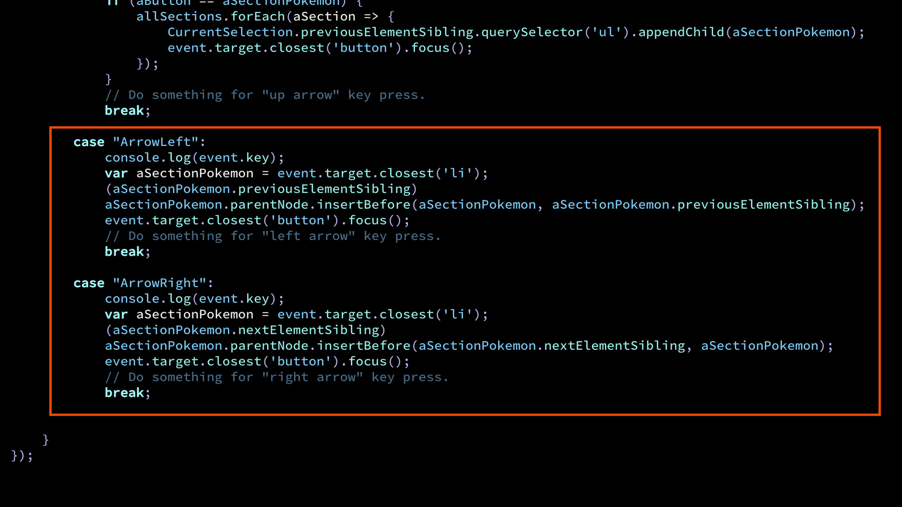
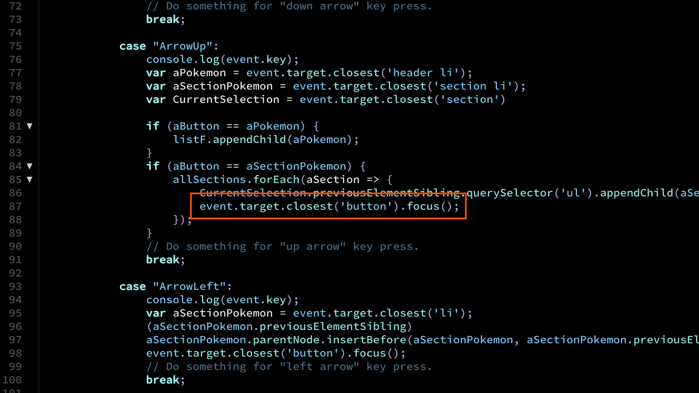
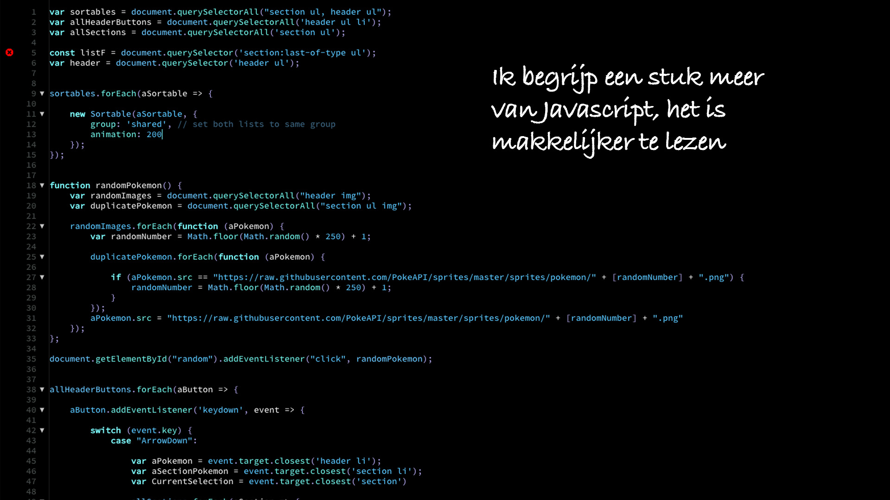

# Procesverslag
**Auteur:** Alex Lanting

**De opdrachten:** [opdracht 1](opdracht1/index.html) en [opdracht 2](opdracht2/index.html)

Markdown is een simpele manier om HTML te schrijven.  
Markdown cheat cheet: [Hulp bij het schrijven van Markdown](https://github.com/adam-p/markdown-here/wiki/Markdown-Cheatsheet).

Nb. De standaardstructuur en de spartaanse opmaak van de README.md zijn helemaal prima. Het gaat om de inhoud van je procesverslag. Besteedt de tijd voor pracht en praal aan je website.

Nb. Door *open* toe te voegen aan een *details* element kun je deze standaard open zetten. Fijn om dat steeds voor de relevante stuk(ken) te doen.

## Bronnenlijst
  1. https://fonts.google.com/specimen/Nobile (font dat lijkt op kodak font)
  2. https://sortablejs.github.io/Sortable/ (sortable library voor de drag & drop)
  3. https://pokeapi.co/ (pokemon sprites die extern ingeladen worden)

## Opdracht 1 plan

  
uitwerken na schetsen idee (voor week 2)

  ### Je storyboard:
  

  ### Je ambitie: 
  Aan deze technieken/punten wil ik werken:
  - Ik wil graag meer weten over animatie, zodat ik als designer weet wat er allemaal mogelijk is. 
  - CSS tricks leren zodat ik die kan toepassen op mijn eigen website. 
  - Pseudo-elements gebruiken, nog nooit gebruikt. 
  - ...
 

## Opdracht 1 reflectie

  
uitwerken bij afronden opdracht (voor week 3)

  ### Je uitkomst - karakteristiek screenshot(s):
  

  ### Dit ging goed/Heb ik geleerd: 
  Het logo op de webpagina zetten door middel van clip art zonder een svg te gebruiken. Ik heb nog nooit met clip art gewerkt dus dit was erg leerzaam. Verder heb ik de clip art op pseudo-elements gezet. Het was ook erg leerzaam om de pseudo-elementen te gebruiken voor het logo. Verder heb ik mijn css animatie techniek weer up to date gemaakt.  

  

  ### Dit was lastig/Is niet gelukt:
  Ik wou graag de achtergrond van de pagina grainy maken wanneer je over het kodak logo gaat met je muis. Eerst had ik deze grain op de body::after gezet, alleen omdat het logo element in het body element zit kon ik deze niet aanspreken op hover. Daarom heb ik de grain op het div element gezet zodat het een sibling element is en deze kon ik dus nu wel op hover aanspreken. Verder was het lastig om het gewenste effect, het nabootsen van 8mm film die afspeelt te visualiseren op een witte achtergrond met een rood logo. Daarom heb ik ervoor gekozen om op de achtergrond op dark en light mode donker te houden. Het effect werkt wel beter wanneer het logo wit is in plaats van rood omdat het contrast dan hoger is en je meer dat flitsende effect kunt zien. 

  

## Opdracht 2 plan

  
uitwerken na schetsen idee (voor week 4)

  ### Je ontwerp:
   
  

  ### Je ambitie: 
  Aan deze technieken/punten wil ik werken:
  - Ik wil graag een lijst kunnen maken met html & css.
  - Ik wil graag expirimenteren met drag en drop. 
  - Elementen verschuiven met toetsenbord of andere controls.
  - Em gebruiken, normaal gebruik ik altijd pixels en procenten.
  - CSS code voorzien van duidelijk commentaar.

## Opdracht 2 test

  
uitwerken na testen (week 6/7)

  Neem minimaal 5 bevindingen op:

  ### Bevinding 1:
  Wanneer je de pokemon een focus gaf lukte het niet om ze met de arrow keys te verschuiven van links naar rechts. 
  
  
  

  #### oplossing:
  Ik heb met javascript door middel van nextElementSibling en PreviousElementSibling het probleem opgelost. 
  
  

  ### Bevinding 2:
  Ik wou graag dat je met de arrow keys de pokemons van tier lists kon verschuiven.
  
    

  #### oplossing:
  Ik heb met behulp van een nextElementSibling, querySelector en een appendChild de pokemon van tier kunnen laten wisselen met de arrow keys wanneer ze focus hebben. 

   

  ### Bevinding 3:
  Wanneer je de pokemon hebt verschoven tijdens de focus met de arrow keys verliest de pokemon de focus. 
  
  
  
  #### oplossing:
  Ik heb aan het einde van de javascript code de pokemon een focus gegeven nadat die verschoven is. 
  
  
  
  ### Bevinding 4:
  Wanneer je de pokemon in de list naar rechts verplaats stopt hij op het einde maar aan de linker kant aan het einde komt de pokemon weer helemaal rechts terecht, het zou beter zijn als dit niet kon gebeuren.  
  
  
  
  #### oplossing:
  Er voor zorgen dat de "li" niet van de eerste naar de laatste plek kan gaan, deze code schrijven is mij niet gelukt. 
  
  
  ### Bevinding 5:
  Ik had een random pokemon button toegevoegd omdat het ook leuk is om een tier list te maken van random pokemons. Alleen wanneer je deze random knop inklikte had je soms dat je een paar dezelfde pokemons in je list kreeg. 
  
  
  
  #### oplossing:
  Een extra stuk code toevoegen die checkt welk nummer math random heeft en wanneer die hetzelfde is doet de functie nogmaals een math random om zo te voorkomen dat er duplicates zijn. 
  
  
  

## Opdracht 2 reflectie

  
uitwerken bij afronden opdracht (voor week 8)

  ### Je uitkomst - karakteristiek screenshot(s):
   
  
  

  ### Dit ging goed/Heb ik geleerd: 
   
   
  
  
  Ik heb mijn code een stuk netter gemaakt dan ik normaal zou doen, dit maakt het een stuk overzichtelijker. Verder heb ik veel geleerd van de Javascript functies schrijven. Vooral nextElementSibling en appendChild zijn functies die ik nu beter begrijp en van pas kunnen komen. Ook heb ik veel met "EM" gewerkt, normaal werk ik altijd met "PX". 

  ### Dit was lastig/Is niet gelukt:
  Korte omschrijving met plaatje(s)

  

